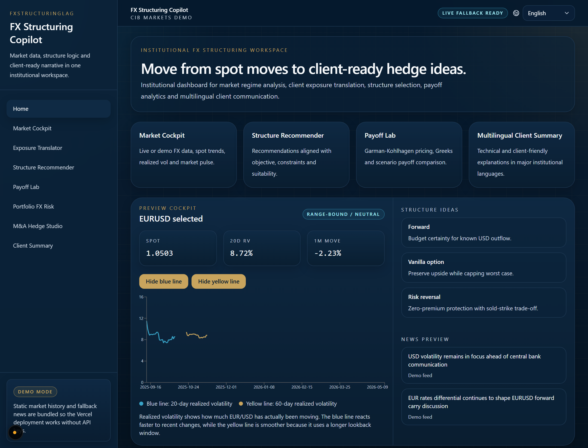
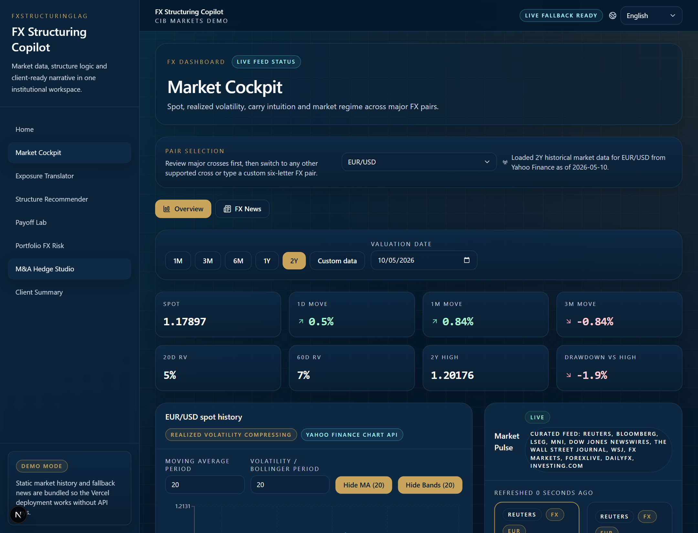
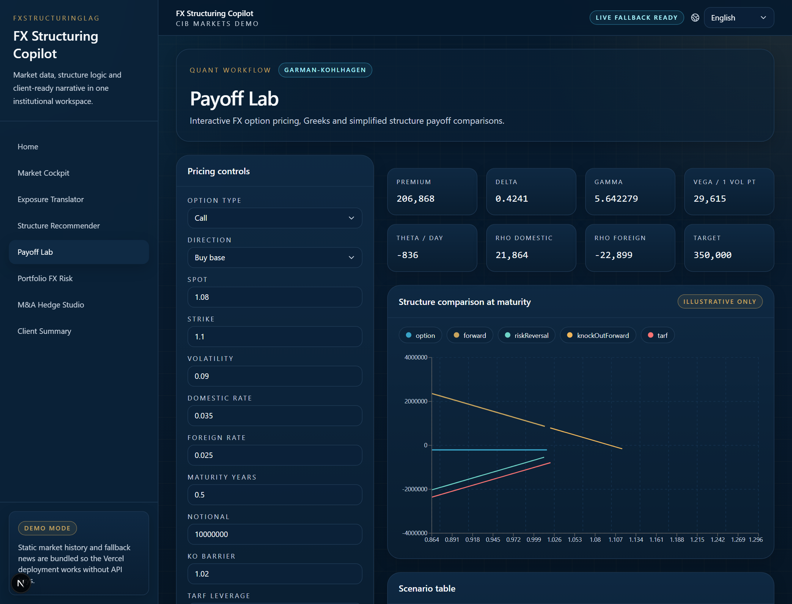
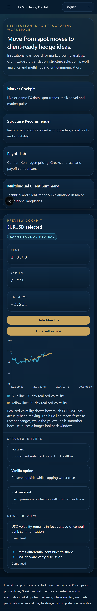

# FXStructuring

<p align="center">
  
</p>

<p align="center">
  <strong>Institutional FX structuring workspace for market monitoring, hedge idea framing, payoff analysis, and multilingual client communication.</strong>
</p>

<p align="center">
  Built with Next.js, TypeScript, Tailwind CSS, Recharts, and next-intl.
</p>

<p align="center">
  <a href="https://fxstructuringlag.vercel.app">Live Demo</a>
  ·
  <a href="#features">Features</a>
  ·
  <a href="#screenshots">Screenshots</a>
  ·
  <a href="#local-development">Local Development</a>
</p>

---

## Overview

FXStructuring is a multilingual web application designed to present FX structuring workflows in a clean, institutional product format.

It brings together:

- market monitoring and spot-history analytics
- hedge structure discovery and recommendation-style flows
- payoff visualization for common FX products
- portfolio and M&A-oriented FX scenario views
- multilingual client-ready summaries

The project is intentionally built to work in both:

- `demo mode`, using bundled fallback datasets
- `live mode`, using free external market and news sources where available

Production deployment: [https://fxstructuringlag.vercel.app](https://fxstructuringlag.vercel.app)

## Features

- Multilingual application shell with `9` locales:
  `en`, `de`, `fr`, `it`, `es`, `pt`, `zh-CN`, `ja`, `ar`
- Locale-prefixed routing with `next-intl`
- RTL support for Arabic
- FX market cockpit with:
  - pair selection
  - valuation date
  - historical range switching
  - moving averages
  - Bollinger bands
  - realized volatility views
- Curated FX news feed using institutional-style sources
- Interactive payoff lab with multiple FX structure comparisons
- Mobile-friendly responsive layouts
- Vercel-ready deployment flow

## Product Areas

### Market Cockpit

The market module is the analytical center of the application.

It includes:

- major and custom FX pair selection
- selectable history windows: `1M`, `3M`, `6M`, `1Y`, `2Y`, custom
- valuation-date-driven analysis
- spot history overlays
- realized volatility tracking
- curated market news with selectable article view

### Exposure and Structures

The exposure and structuring areas frame hedge ideas in a more user-facing workflow, helping translate FX risk into suitable product discussions such as:

- forwards
- vanilla options
- risk reversals
- knock-out forwards
- TARF-style comparisons

### Payoff Lab

The payoff lab provides interactive payoff comparison and option-pricing support with:

- Garman-Kohlhagen-based pricing inputs
- structure comparison charting
- toggleable series
- Greeks and scenario-style metrics

### Summary and Client Communication

The summary views are designed to support multilingual explanation and client-facing communication in a more polished narrative format.

## Screenshots

### Homepage


### Market Cockpit



### Payoff Lab



### Mobile Experience

<p align="center">
  
</p>

## Technology Stack

- `Next.js 16`
- `React 19`
- `TypeScript`
- `Tailwind CSS`
- `next-intl`
- `Recharts`
- `date-fns`

## Repository Structure

```text
app/
  [locale]/
    exposure/
    ma/
    market/
    payoff-lab/
    portfolio/
    structures/
    summary/
  api/
    fx/live
    fx/market
    news/fx

components/
  common/
  home/
  layout/
  ma/
  market/
  payoff-lab/
  portfolio/
  structuring/
  summary/
  ui/

data/
  fx/
  news/

lib/
  api/
  content/
  pricing/
  server/

messages/
scripts/
```

## Data Strategy

The application uses a layered data model so the product remains usable without paid infrastructure.

### Market Data

- Historical FX spot series are fetched through Yahoo Finance chart endpoints
- Client-side requests are centralized in [lib/api/client.ts](</C:/Users/eric.benhamou/Documents/New project 3/lib/api/client.ts:1>)
- Server-side data access is centralized in [lib/server/fx-data.ts](</C:/Users/eric.benhamou/Documents/New project 3/lib/server/fx-data.ts:1>)
- If live data is unavailable, the application falls back to bundled demo datasets in `data/fx`

### News

The FX news feed is filtered toward recognized financial and market-oriented sources, including:

- Reuters
- Bloomberg
- LSEG
- MNI
- Dow Jones / WSJ
- FX Markets
- ForexLive
- DailyFX
- Investing.com

Fallback demo headlines are used when live retrieval is unavailable.

### Optional Environment Variables

The project runs without API keys, but can use the following when present:

```bash
GNEWS_API_KEY=
ALPHA_VANTAGE_API_KEY=
```

## Local Development

Install dependencies:

```bash
pnpm install
```

Start the development server:

```bash
pnpm dev
```

Open the application:

```text
http://127.0.0.1:3000/en
```

## Available Scripts

```bash
pnpm dev
pnpm build
pnpm start
pnpm lint
pnpm generate:data
```

## Deployment

The project is configured for Vercel deployment.

Typical production validation:

```bash
pnpm build
pnpm lint
```

Current production deployment:

- [https://fxstructuringlag.vercel.app](https://fxstructuringlag.vercel.app)

## Contributor Notes

- Package manager: `pnpm`
- Locales are configured in [i18n.ts](</C:/Users/eric.benhamou/Documents/New project 3/i18n.ts:1>)
- Locale routing is configured in [i18n/routing.ts](</C:/Users/eric.benhamou/Documents/New project 3/i18n/routing.ts:1>)
- Market/news API routes live under `app/api`
- Demo datasets are stored in `data/`
- `.vercel`, `.next`, and `node_modules` are intentionally excluded from version control

## Attribution

This repository is maintained and pushed for **Noemie Benhamou**.
